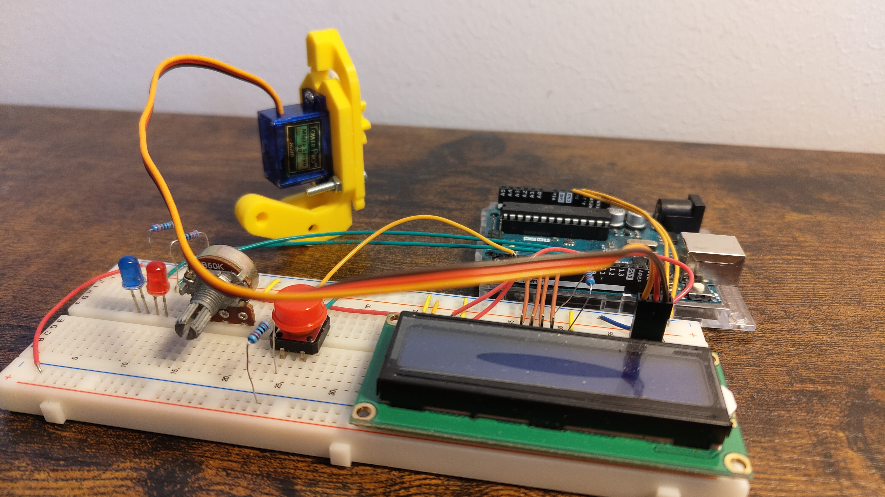
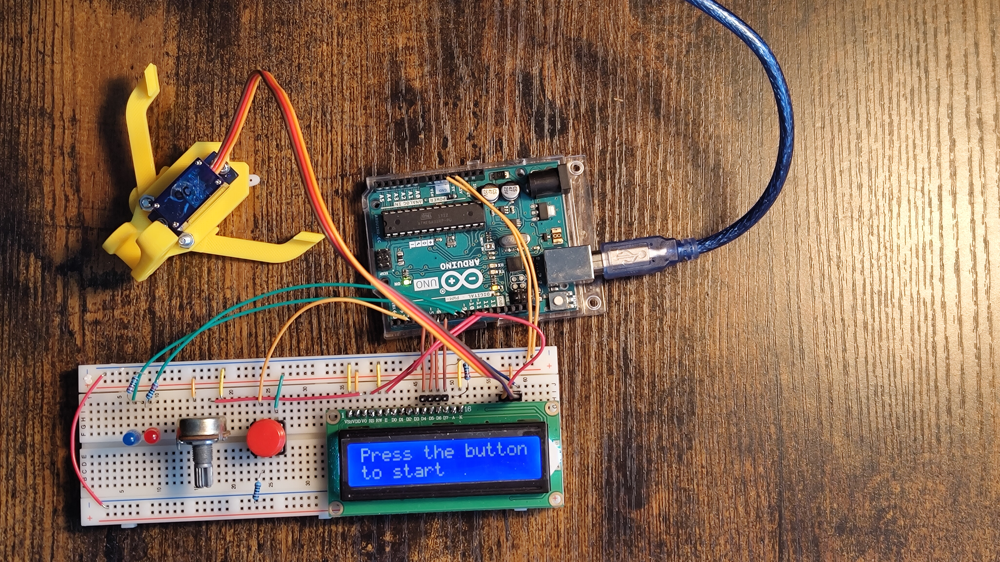
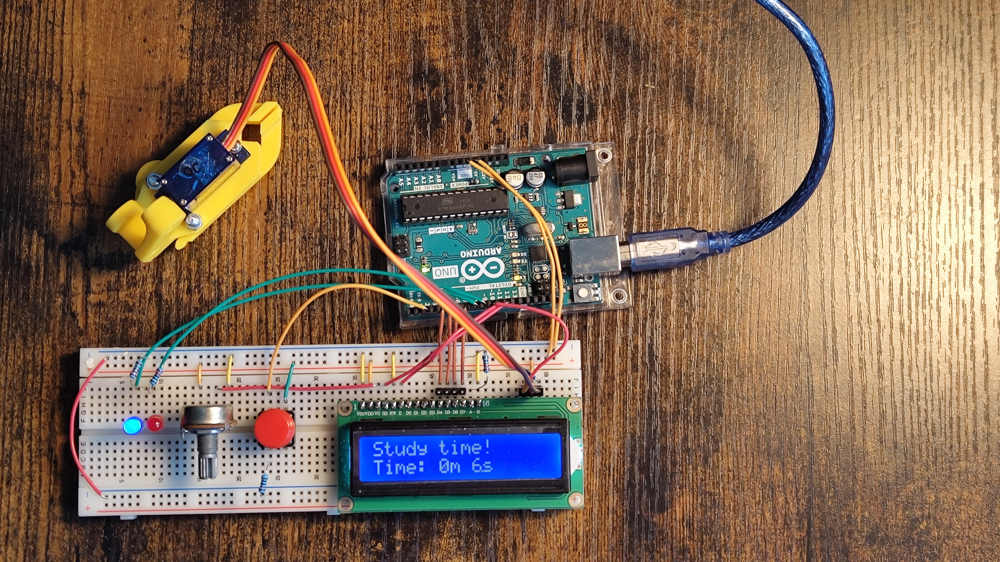
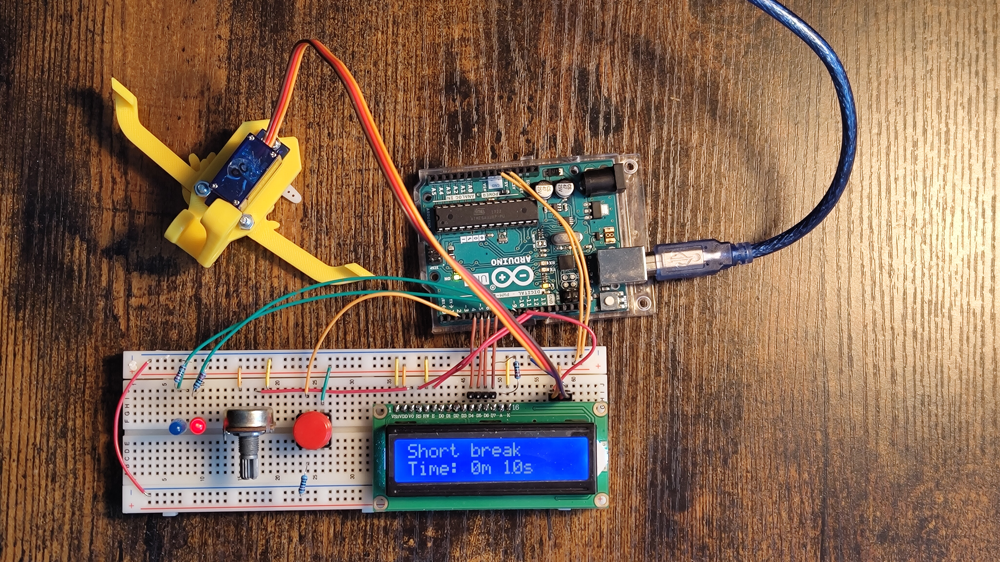
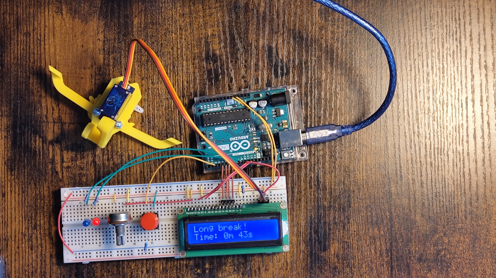

# Pomodoro Clock with Servo Arm

This project implements a Pomodoro clock using an Arduino, an LCD display, LEDs, buttons and a servo motor. The clock follows the Pomodoro Technique, a time management method that uses a timer to break down work into intervals.

## Project Overview

This Pomodoro clock has the following features:
- **LCD Display:** An LCD display shows the elapsed time during each study and break session.
- **LED Indicators:** LEDs indicate whether it's study time or break time.
- **Button Trigger:** The clock is triggered by pressing a button to start the Pomodoro sessions.
- **Study Time:** The servo arm holds on to an object during the study period, simulating focused work.
- **Break Time:** The servo arm opens during break time, providing a visual cue for the break period.

## Components Used

- Arduino Board
- LCD Display (16x2)
- LEDs (2)
- Servo Motor
- Potentiometer
- Push Button
- Resistors
- Wires

## Circuit Setup

Follow the circuit diagram provided in the schematics folder to connect the components. Make sure to set up the servo arm in a way that it can hold and release an object.

## Usage

1. Upload the provided Arduino code to your Arduino board.
2. Connect the components according to the circuit diagram.
3. Power on the Arduino board.
4. Press the button to start the Pomodoro sessions.

## Configuration

Adjust the following parameters in the Arduino code according to your preferences:

- `study_minutes`: Duration of each study session in minutes.
- `repeats`: Number of study-break cycles before a long break.
- `short_break_minutes`: Duration of short breaks in minutes.
- `long_break_minutes`: Duration of long breaks in minutes.

## Notes

- Ensure that the servo arm is appropriately set up to hold and release an object.
- Customize the code or circuit based on your specific requirements.
- Possibility to replace arm with a locking mechanism to create a safe that opens when on break time and closes on study time.

## Credits

This project was created by me. Feel free to contribute or modify the code to suit your needs.
